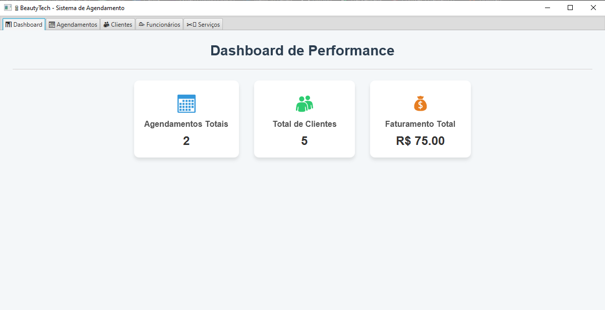

# 📅 Sistema de Agendamento Online em Java

Este projeto é um **treino prático** desenvolvido em Java, simulando um sistema de agendamento e gestão de clientes. O objetivo é criar uma solução completa para pequenos e médios negócios (como salões de beleza, clínicas e consultórios) que precisam gerenciar horários e informações de clientes.

---

## 🚀 Funcionalidades

- Login e autenticação
- Dashboard com indicadores de agendamentos e faturamento
- Cadastro, consulta, atualização e exclusão de clientes e funcionários
- Cadastro e gerenciamento de serviços (preço, duração)
- Sistema de agendamento inteligente que verifica a disponibilidade de horários
- Geração de IDs automáticos com verificação no banco
- Relatórios básicos (ex: agendamentos do dia)

---

## 🧰 Tecnologias Utilizadas

| Tecnologia / Ferramenta | Finalidade |
|--------------------------|------------|
| `Java SE 8+`             | Lógica da aplicação |
| `JavaFX`                 | Interface Gráfica (GUI) |
| `JDBC`                   | Conexão com banco de dados |
| `MySQL`                  | Banco de dados relacional |

---

## 💡 Competências Exercitadas

- **Programação Orientada a Objetos (POO):** Modelagem de classes (`Funcionario`, `Cliente`, `Agendamento`) com uso de encapsulamento, construtores e métodos de acesso (getters/setters).
- **Desenvolvimento de Aplicações Desktop:** Criação de uma interface gráfica (GUI) funcional e responsiva utilizando **JavaFX**, demonstrando a capacidade de construir aplicações com foco na experiência do usuário.
- **Integração com Banco de Dados Relacional:** Conexão e manipulação de dados em **MySQL** utilizando **JDBC**. Uso de `PreparedStatement` para consultas seguras, garantindo a prevenção de injeção de SQL.
- **Gerenciamento de Dados e SQL:** Criação de tabelas, definição de chaves primárias e estrangeiras (FKs) e execução de operações CRUD (Criar, Ler, Atualizar, Deletar) para cada entidade do sistema.
- **Lógica de Negócio e Validação:** Implementação de regras de negócio, como a geração e verificação de **IDs únicos**, e lógica para validar a disponibilidade de horários no agendamento.
- **Tratamento de Exceções:** Gerenciamento robusto de erros, incluindo o uso de `try-with-resources` e a captura de exceções específicas (`SQLException`, `InputMismatchException`) para garantir a estabilidade da aplicação.

---

## 🖼️ Screenshots

---

## 🧪 Como Executar

1.  Certifique-se de ter o **Java JDK** instalado (versão 8 ou superior).
2.  Crie o banco de dados `agendamento` no MySQL com as tabelas adequadas (cliente, funcionario, servico, agendamento) usando o arquivo `SistemaAgendamento - SQL.txt`.
3.  Ajuste a string de conexão na sua classe de persistência para corresponder às suas credenciais.
4.  Execute a classe principal.

---

## ⚠️ Observações

- Este projeto foi desenvolvido para fins de estudo e prática de habilidades de desenvolvimento full-stack.
- O código foi concentrado em algumas classes para fins de didática e praticidade.

---

## 📁 Estrutura do Projeto
📦 SistemaDeAgendamento
┣ 📁 Screenshots               # Pasta com as imagens do README
┣ 📄 SistemaAgendamentoUI.java       # Interface gráfica e inicialização
┣ 📄 SistemaAgendamento.java         # Lógica de negócio e banco de dados
┣ 📁 model

┃  ┣ 📄 Cliente.java
┃  ┣ 📄 Funcionario.java
┃  ┣ 📄 Servico.java
┃  ┗ 📄 Agendamento.java
---

## ✍️ Autor

**Gustavo Martins Cirino** Estudante de Ciências da Computação • Java & Banco de Dados  
[GitHub Profile] https://github.com/Gustavo-Martins-Cirino  

---

## 📌 Licença

Este projeto é livre para uso educacional e pessoal. Sinta-se à vontade para estudar, adaptar e compartilhar.
